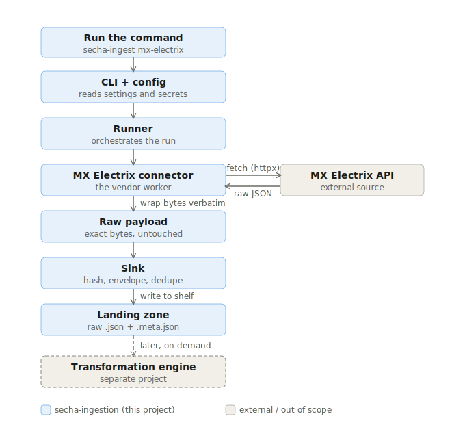

# secha-ingestion

> Vendor-agnostic **raw ingestion layer** for the SECHA EV-charging data interoperability framework.

`secha-ingestion` fetches partner data and lands it **verbatim** — no parsing, scaling, renaming, or
re-serialisation — into an immutable, replayable landing zone (the medallion **Bronze** layer). All
transformation happens *later*, in the separate `secha-transform` engine, driven by `secha-metadata`
configs. Keeping ingestion "dumb on purpose" guarantees a pristine source of truth you can always
re-process.

## Architecture at a glance



Read it top to bottom: a **command** starts the **CLI + config**, the **runner** drives the loop, the
**MX Electrix connector** calls the external **API** and gets **raw JSON** back, wraps those exact bytes
as a **raw payload**, the **sink** fingerprints + labels (envelope) + de-duplicates it, and writes it
**verbatim to the landing zone**. The grey, dashed boxes (the external API and the future transform
engine) are outside this repo — processing happens later, reading from the pristine shelf.

## Where this fits in the SECHA system
```
secha-ingestion  →  raw JSON (Bronze)         ← this repo
secha-metadata   →  the transformation rulebook (config-as-code)
secha-transform  →  reads raw + rulebook → canonical data (Delta / Unity Catalog)   ← next milestone
```

## Principles (what makes this "raw, no processing")
1. **Bytes verbatim** — the HTTP body is written exactly as received; never parsed/re-serialised.
2. **Envelope, not edit** — provenance (vendor, endpoint, params, fetch time, content hash, source
   version, sensitivity) goes in a sidecar `*.meta.json`; the payload stays pristine.
3. **Idempotent + immutable** — path keyed on `(vendor, source, partition)`; the content SHA-256 only
   *detects change* — identical content is skipped, changed content lands as a new snapshot. Nothing is
   ever overwritten.
4. **Format-agnostic sink** — stores any bytes (JSON now; CSV/Parquet/XML later) under one envelope.
5. **Resilience ≠ transformation** — retries, backoff, timeouts, TLS handling live here; field logic
   does not.

`core/` is **vendor-blind**: it must never import from `connectors/` or contain `if vendor == ...`.
A new vendor is a new file in `connectors/` + a CLI command — **zero changes to `core/`**.

## Design decisions (the load-bearing ones)
- **Deterministic, no transformation in ingestion.** Scaling, timestamp normalisation, and field
  selection are deliberately the transform engine's job.
- **Raw, immutable landing storing bytes verbatim.** Higher fidelity than the legacy CSV, with full
  auditability and replayability.
- **Vendor-blind core + per-vendor connectors, abstraction deferred.** The `SourceConnector` interface
  is intentionally minimal and will be refactored once a *second* connector (Kempower) exists — avoiding
  a wrong abstraction designed on one example.

## Quickstart

Using **uv** (recommended):
```bash
uv sync --all-extras --dev
cp .env.template .env          # fill in SECHA_ELECTRIX_HOST_URL + SECHA_ELECTRIX_ACCESS_TOKEN
uv run secha-ingest --help
uv run secha-ingest mx-electrix --date 2025-08-15 --meter 21
```

Without uv:
```bash
python -m venv .venv
.venv/Scripts/pip install -e .          # Linux/macOS: .venv/bin/pip
.venv/Scripts/secha-ingest mx-electrix --date 2025-08-15 --meter 21
```

> A real fetch needs the MX Electrix host URL + token and network access to that host
> (typically the TUNI network/VPN). No credentials yet? `pytest` exercises the full pipeline offline
> against a mocked API.

## Landing-zone layout (Hive-partitioned, WORM)
```
<SECHA_LANDING_ROOT>/vendor=mx_electrix/source=measurements/date=2025-08-15/meter=21/
    <sha16>.json        # raw response body, verbatim
    <sha16>.meta.json   # IngestionEnvelope (provenance only)
```
`source=meters` (the device list) lands with no `meter=` key. Hive-style partitioning is read natively
by Spark and Databricks Autoloader downstream. The landing root is configurable via `SECHA_LANDING_ROOT`
(`data/landing` locally, `s3://…` / `abfs://…` / a Unity Catalog Volume in production) through `fsspec`
— no code change.

## Adding a new vendor connector
1. Add `src/secha_ingestion/connectors/<vendor>.py` implementing the `SourceConnector` protocol
   (`name`, `version`, `list_partitions`, `fetch`). Return raw bytes — **never** transform.
2. Add a CLI subcommand in `cli.py`.
3. Add a connector test under `tests/connectors/` (mock the API with `respx`).
   No change to `core/`. That property is the ingestion-side proof of the framework's decoupling claim.

## Project layout
```
src/secha_ingestion/
  core/        # vendor-blind: models, envelope, connector Protocol, sink, runner
  connectors/  # one module per vendor (mx_electrix first)
  config.py    # pydantic-settings (env-prefixed SECHA_)
  cli.py       # typer entrypoint
  logging.py   # structlog setup
tests/         # sink + connector tests (offline, mocked)
docs/          # architecture diagram, open questions
```

## Configuration
All settings are environment variables prefixed `SECHA_` (read from `.env`; secrets never in code).

| Variable | Default | Purpose |
|---|---|---|
| `SECHA_LANDING_ROOT` | `data/landing` | where raw data lands (local path or `s3://…`/`abfs://…`) |
| `SECHA_REQUEST_TIMEOUT_S` | `20` | per-request timeout |
| `SECHA_MAX_RETRIES` | `3` | retry attempts (resilience, not transformation) |
| `SECHA_ELECTRIX_HOST_URL` | — | MX Electrix API base URL |
| `SECHA_ELECTRIX_ACCESS_TOKEN` | — | API key (kept in `.env`, gitignored) |
| `SECHA_ELECTRIX_ALLOW_INVALID_CERTS` | `false` | set `true` if the host uses a self-signed cert |
| `SECHA_ELECTRIX_FIELDS` | unset | leave unset to request the server default (all fields) |

## Quality gates
```bash
uv run ruff check . && uv run ruff format --check .
uv run mypy src
uv run pytest
```
All four run in CI on every push (`.github/workflows/ci.yml`).

## Status / open items
- **Scope:** vertical slice — MX Electrix `/meters/` + `/measurements/` only. `/events/`,
  `/events/{id}/`, `/ssstamps/` are deliberately out of scope here for now for this slice.
- **Open questions (data platform):** see [docs/open-questions.md](docs/open-questions.md) —
  the blocking ones concern pagination, the `fields` parameter, and timestamp/timezone semantics.
- **`SourceConnector` interface** will be refactored when the Kempower connector lands.
- **License:** TBD — confirm with the SECHA project / supervisor before any public release.
