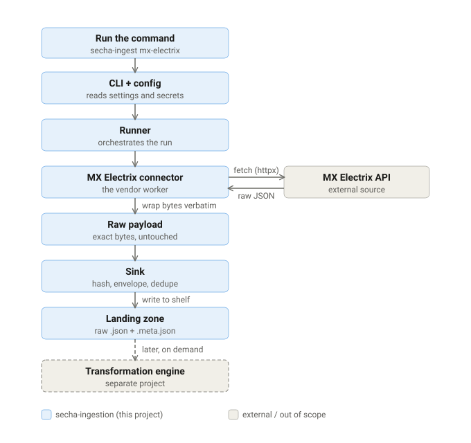

# secha-ingestion

> Vendor-agnostic **raw ingestion layer** for the SECHA EV-charging data interoperability framework.

`secha-ingestion` fetches partner data and lands it **verbatim** (no parsing, scaling, renaming, or
re-serialisation) into an immutable, replayable landing zone: the medallion **Bronze** layer. All
transformation happens *later*, in the separate `secha-transform` engine, driven by `secha-metadata`
configs. Keeping ingestion "dumb on purpose" guarantees a pristine source of truth you can always
re-process.

## Architecture at a glance



Read it top to bottom: a **command** starts the **CLI + config**, the **runner** drives the loop, and a
**vendor connector** fetches the raw bytes. For MX Electrix (shown) that means calling the external
**API** and receiving **raw JSON**; for ProCem it means reading daily 7-Zip archives from a file share,
and for Kempower, checking each Parquet file of a Spark export against its checksums. Either way
the connector wraps the exact bytes as a **raw payload**, and the **sink** fingerprints, labels
(envelope), de-duplicates, and writes them **verbatim to the landing zone**. The grey, dashed
boxes (the external API and the transform engine) are outside this repo; processing happens later,
reading from the pristine shelf.

## Where this fits in the SECHA system
```
secha-ingestion  →  raw data (Bronze)         ← this repo
secha-metadata   →  the transformation rulebook (config-as-code)
secha-transform  →  reads raw + rulebook → canonical data (Delta / Unity Catalog)
```

## Principles (what makes this "raw, no processing")
1. **Bytes verbatim.** The fetched body is written exactly as received, never parsed or re-serialised.
2. **Envelope, not edit.** Provenance (vendor, endpoint, params, fetch time, content hash, source
   version, sensitivity) goes in a sidecar `*.meta.json`; the payload stays pristine.
3. **Idempotent + immutable.** The path is keyed on `(vendor, source, partition)`; the content SHA-256
   only *detects change*: identical content is skipped, changed content lands as a new snapshot.
   Nothing is ever overwritten.
4. **Format-agnostic sink.** Stores any bytes under one envelope. The media type only picks the file
   extension (JSON, CSV, XML and Parquet have their own; anything else lands as `.bin`).
5. **Resilience ≠ transformation.** Retries, backoff, timeouts, and TLS handling live here; field logic
   does not.

`core/` is **vendor-blind**: it must never import from `connectors/` or contain `if vendor == ...`.
A new vendor is a new file in `connectors/` + a CLI command. `core/` changes only for something every
vendor can use: Kempower added one line, Parquet's media type in the sink's extension table, and no
vendor logic.

## Design decisions (the load-bearing ones)
- **Deterministic, no transformation in ingestion.** Scaling, timestamp normalisation, and field
  selection are deliberately the transform engine's job.
- **Raw, immutable landing storing bytes verbatim.** Higher fidelity than the legacy CSV, with full
  auditability and replayability.
- **Vendor-blind core + per-vendor connectors, abstraction deferred.** The `SourceConnector` interface
  is intentionally minimal to avoid a wrong abstraction designed on one example. It has now absorbed
  three very different connectors (an authenticated API, a file-archive share and a Spark Parquet
  export) unchanged.
- **Narrowing at source is declared, never silent.** MX Electrix can narrow via the API `fields`
  parameter; ProCem can narrow to a declared rtl_id subset (line selection, bytes untouched). Both
  filters are recorded in the landing envelope, so provenance always says exactly what was requested.
- **Verify before landing, when the source makes it possible.** Writing to a local or HDFS file
  system, Spark leaves a `.crc` sidecar with a CRC32 for every 512 bytes of each file. The Kempower
  connector checks them all; a part that fails is never landed, the run names it and exits
  non-zero, and the verified parts land regardless.

## Quickstart

Using **uv** (recommended):
```bash
uv sync --all-extras --dev
cp .env.template .env          # fill in SECHA_ELECTRIX_HOST_URL + SECHA_ELECTRIX_ACCESS_TOKEN
uv run secha-ingest --help
uv run secha-ingest mx-electrix --date 2025-08-15 --meter 21
uv run secha-ingest procem --date 2026-06-15        # needs the ProCem archive share (see below)
uv run secha-ingest kempower                        # needs the Kempower export directory
```

Without uv:
```bash
python -m venv .venv
.venv/Scripts/pip install -e .          # Linux/macOS: .venv/bin/pip
.venv/Scripts/secha-ingest mx-electrix --date 2025-08-15 --meter 21
```

> A real MX Electrix fetch needs the host URL + token and network access to that host (typically the
> TUNI network/VPN). A real ProCem run needs the group-drive archives (`SECHA_PROCEM_SOURCE_URL`), and
> a Kempower run needs the Spark export directory (`SECHA_KEMPOWER_SOURCE_URL`). None at hand?
> `pytest` exercises all three pipelines offline (mocked API, fixture archives, a fixture export).

## Landing-zone layout (Hive-partitioned, WORM)
```
<SECHA_LANDING_ROOT>/
  vendor=mx_electrix/source=measurements/date=2025-08-15/meter=21/
      <sha16>.json        # raw response body, verbatim
      <sha16>.meta.json   # IngestionEnvelope (provenance only)
  vendor=procem_kampusareena_pq/source=daily_dump/date=2026-06-15/
      <sha16>.csv         # the day's selected lines, verbatim (+ envelope)
  vendor=kempower/source=public_passenger_dataset/export=95d29330/part=00000-c000/
      <sha16>.parquet     # one Spark part file, verbatim (+ envelope)
```
Every payload has its `.meta.json` envelope beside it. `source=meters` (the MX Electrix device
list) lands with no `meter=` key. ProCem's `date=` is the **Helsinki-local** day, faithful to the
archive boundary, while canonical `event_date` is derived from timestamps downstream. Kempower's
`export` is the first 8 hex digits of the Spark write job's UUID (the full UUID is in the
envelope) and `part` is Spark's task number and file counter; keying on the write job keeps two
exports from ever mixing. Hive-style partitioning is read natively by Spark and Databricks
Autoloader. The landing root is configurable via `SECHA_LANDING_ROOT`
(`data/landing` locally; `s3://…`, `abfs://…`, or a Unity Catalog Volume in production) through
`fsspec`, with no code change.

## Adding a new vendor connector
1. Add `src/secha_ingestion/connectors/<vendor>.py` implementing the `SourceConnector` protocol
   (`name`, `version`, `list_partitions`, `fetch`). Return raw bytes; **never** transform.
2. Add a CLI subcommand in `cli.py`.
3. Add a connector test under `tests/connectors/`: mock the API with `respx` (API vendors) or build
   tiny fixture files in the test (file vendors, see `test_procem.py` and `test_kempower.py`).
   No vendor logic in `core/`. That property is the ingestion-side proof of the framework's
   decoupling claim. The protocol, runner and landing logic have held for all three connectors;
   the one `core/` edit so far, Parquet's media type, named a format rather than a vendor.

## Project layout
```
src/secha_ingestion/
  core/        # vendor-blind: models, envelope, connector Protocol, sink, runner
  connectors/  # one module per vendor: mx_electrix (API), procem (file archives),
               # kempower (Spark Parquet export)
  config.py    # pydantic-settings (env-prefixed SECHA_)
  cli.py       # typer entrypoint
  logging.py   # structlog setup
tests/         # sink, config + connector tests (offline: mocked API, fixture archives and export)
docs/          # architecture diagram, open questions
```

## Configuration
All settings are environment variables prefixed `SECHA_` (read from `.env`; secrets never in code).

| Variable | Default | Purpose |
|---|---|---|
| `SECHA_LANDING_ROOT` | `data/landing` | where raw data lands (local path or `s3://…`/`abfs://…`) |
| `SECHA_REQUEST_TIMEOUT_S` | `20` | per-request timeout |
| `SECHA_MAX_RETRIES` | `3` | retry attempts (resilience, not transformation) |
| `SECHA_ELECTRIX_HOST_URL` | (required) | MX Electrix API base URL |
| `SECHA_ELECTRIX_ACCESS_TOKEN` | (required) | API key (kept in `.env`, gitignored) |
| `SECHA_ELECTRIX_ALLOW_INVALID_CERTS` | `false` | set `true` if the host uses a self-signed cert |
| `SECHA_ELECTRIX_FIELDS` | unset | leave unset to request the server default (all fields) |
| `SECHA_PROCEM_SOURCE_URL` | (required for procem) | directory of `YYYY-MM-DD_procem.7z` archives (path or fsspec URL) |
| `SECHA_PROCEM_IDS` | unset | rtl_id subset to land (e.g. `23501-23949` = EV charging meter); unset lands the whole day file |
| `SECHA_KEMPOWER_SOURCE_URL` | (required for kempower) | directory of the Spark export's `part-*.parquet` files and their `.crc` sidecars (path or fsspec URL) |

`.env` is read as UTF-8, so paths with Finnish letters work on Windows too.

## Quality gates
```bash
uv run ruff check . && uv run ruff format --check .
uv run mypy src
uv run pytest
```
All four run in CI on every push (`.github/workflows/ci.yml`).

## Status / open items
- **Scope:** three vendors. (1) MX Electrix `/meters/` + `/measurements/` (API; `/events/`,
  `/events/{id}/`, `/ssstamps/` deliberately out of slice). (2) **ProCem daily dumps**
  (`secha-ingest procem`: 7z file archives, optional rtl_id subset, Kampusareena EV-charging
  meter by default). (3) **Kempower passenger charging dataset** (`secha-ingest kempower`: the
  Spark Parquet export TAU made from Kempower's Delta Sharing table, verified part by part).
- **Kempower is 99 of 100 parts.** `part-00099` is cut short in every copy we hold, so it is
  refused; the 99 landed parts hold 71,793,566 of the 72,546,284 rows. A clean copy of that one
  file will land on the next run. Details in [docs/open-questions.md](docs/open-questions.md).
- **Open questions (data sources):** see [docs/open-questions.md](docs/open-questions.md).
  The once-blocking MX Electrix questions (pagination, `fields`, timezone, scaling) are resolved;
  the remaining items are confirmations, not blockers.
- **`SourceConnector` interface:** absorbed all three connectors unchanged, Kempower included.
- **License:** proprietary, SECHA project; see [LICENSE](LICENSE).
